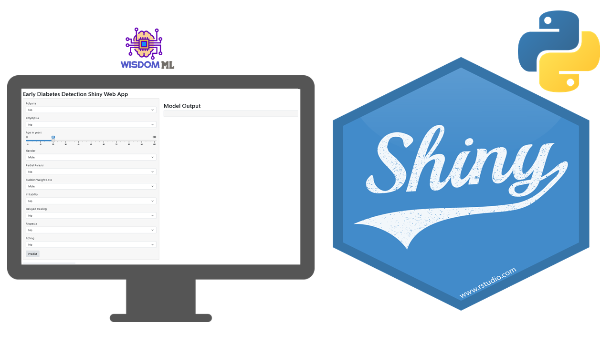

# Early_Diabetes_detection_webapp_shiny_python

This repo consist of web app designed and developed using [shiny for python](https://shiny.rstudio.com/py/) library by RStudio. In this project we have designed a web application to show the project structure for a machine learning model deployed using shiny. This project features a machine learning model that has been trained to detect diabetic patient based on certain input features such as `Age`, `Gender`, `Polyuria`, `Polydispia`, `Partial paresis`, `Sudden weight loss`, `Irritability`, `Delayed healing`, `Alopecia`, and  `Itching`. This application acts as an interface for a user to predict diabetes based on selecting top 10 input features. The machine learning model was built using various features of scikit learn:

* Logistic Regression (LR)
* Min Max Scaler 
* Grid Search + Cross Validation

Each of these components are developed within the project in an offline setting inside `/model`. The LR and Min-Max scaler models will still be needed in a production or testing setting in order to be able to predict user-submitted queries, so they can be serialized via python's pickle functionality and stored within the `/model` folder.

You can also find a blog post that accompanies this repo [here](https://wisdomml.in/early-diabetes-detection-web-app-using-shiny-in-python/).

## Installation

First clone the repo locally.
~~~bash
git clone https://github.com/wisdomml2020/Early_Diabetes_detection_webapp_shiny_python.git
~~~

Create a new virtual environment in the project directory.
~~~bash
python3 -m venv ./venv
~~~

Activate the virtual environment.
~~~bash
source venv/bin/activate
~~~

While in the virtual environment, install required dependencies from `requirements.txt`.

~~~bash
pip install -r ./requirements.txt
~~~

Now we can deploy the web application via
~~~bash
python app.py
~~~

and navigate to `http://127.0.0.1:8000/` to see it live. On this page, a user can then submit different features from UI into the drop down and slider 
input field and get the predictions from the trained model in the form of probability of diabetes.

The application may then be terminated with the following commands.
~~~bash
$ ^C           # exit flask application (ctrl-c)
$ deactivate   # exit virtual environment
~~~

## Project Structure 

~~~
Early_Diabetes_detection_webapp_shiny_python-web-app
├── model
│   ├── logreg.pkl
│   └── minmax.pkl
├── app.py
├── requirements.txt
└── README.md
